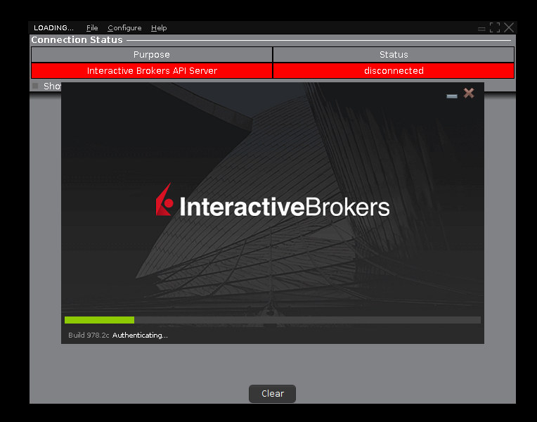
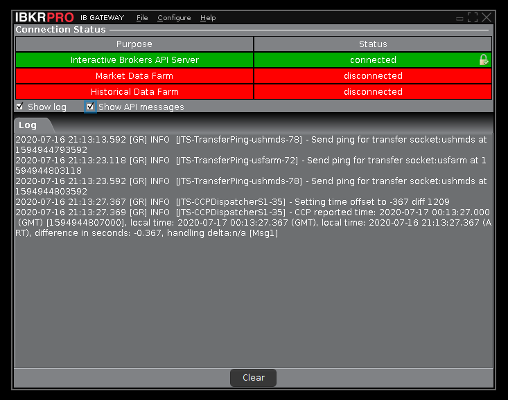

# Interactive Brokers Gateway Docker
[](https://microbadger.com/images/mgvazquez/ibgateway "Get your own version badge on microbadger.com")
[](https://microbadger.com/images/mgvazquez/ibgateway "Get your own image badge on microbadger.com")
[](https://microbadger.com/images/mgvazquez/ibgateway "Get your own commit badge on microbadger.com")
[](https://microbadger.com/images/mgvazquez/ibgateway "Get your own license badge on microbadger.com")

This image runs the last stable (stand-alone) version of ©Interactive Broker Gateway.

---

### Docker Image

The image is based on 'phusion/baseimage:18.04-1.0.0', which is a minimalist image based in Ubuntu Linux with a lot of
improvements to use as docker base image. If you want know more, take a look at your [documentation]('https://github.com/phusion/baseimage-docker#contents')

In addition, it uses the [IBC Project](https://github.com/IbcAlpha/IBC) to manage the configuration
and launch of the ©IBGateway; and serve a VNC server to control the IBC / IBGateway interface.

Current versions:
* Interactive Brokers Gateway: v981.3c
* IBC: v3.12.0

You can find the latest version of this image on docker-hub: [mgvazquez/ibgateway](https://hub.docker.com/r/mgvazquez/ibgateway)

---

### Build the docker image

To build this image, run the following command on the root path of the repo:

```bash
$ docker build -t mgvazquez/ibgateway:latest .
```

> IMPORTANT: Must have `docker` installed on your system.

### Docker Compose

Here are an example of how to run this image with `docker-compose`:

```yaml
version: '3'
services:
  gateway:
    image: mgvazquez/ibgateway:latest
    restart: always
    ports:
      - "7462:7462"
      - "4001:4001"
      - "5900:5900"
    environment:
      - VNC_PASSWORD=<vnc_pass_change_me>
      - VNC_PORT=5900
      - TWSUSERID=<usr_change_me>
      - TWSPASSWORD=<pwd_change_me>
      - TRADING_MODE=paper
```

In this example you will launch the _Interactive Brokers Gateway_ in `paper` mode listening on port `4001`, and the VNC Server
listening on port `5900`.

Another environment variables that you can set are:

| **Variable**  | **Description** | **Required** |
| --------------- | --- | --- |
| _TZ_ | Container timezone<br>**Default:** America/Argentina/Buenos_Aires | no |
| _TWSUSERID_ | IB account user id<br>**Default:** \<change_me\> | yes |
| _TWSPASSWORD_ | IB account password<br>**Default:** \<change_me\> | yes |
| _TRADING_MODE_ | Indicates whether the live account or the paper trading account will be used. Allowed values are: _live / paper_<br>**Default:** paper | no |
| _VNC_PASSWORD_ | VNC Server password<br>**Default:** \<change_me\> | yes |
| _VNC_PORT_ | VNC Server port<br>**Default:** 5900 | no |
| _FIXUSERID_ | FIX account user id<br>**Default:** \<empty\> | no |
| _FIXPASSWORD_ | FIX account password<br>**Default:** \<empty\> | no |
| _IBC_INI_ | Absolute path of the `config.ini` config file (\*)<br>**Default:** /root/IBC/config.ini | no |
| _TWS_CONFIG_PATH_ | Path of the `jts.ini` config file (\*)<br>**Default:** /root/Jts | no |

> (\*) NOTE: The env-vars `IBC_INI` and `TWS_CONFIG_PATH`, only must be used if you mount your custom `config.ini`
> and `jts.ini` files in other paths than the default ones.

> Can find the defaults `config.ini` and `jts.ini` files in the `components` folder in this repo.

#### Launching with docker-compose

> IMPORTANT: Must have `docker-compose` installed on your system.

```bash
$ docker-compose up
Recreating deployment_gateway_1 ... done
Attaching to deployment_gateway_1
gateway_1  | *** Running /etc/my_init.d/00_regen_ssh_host_keys.sh...
gateway_1  | *** Running /etc/my_init.d/10_syslog-ng.init...
gateway_1  | Jul 16 21:12:26 a0c679e721a5 syslog-ng[13]: syslog-ng starting up; version='3.13.2'
gateway_1  | *** Booting runit daemon...
gateway_1  | *** Runit started as PID 22
gateway_1  | Jul 16 21:12:27 a0c679e721a5 ibcontroller: Starting Interactive Brokers Controller
gateway_1  | Jul 16 21:12:27 a0c679e721a5 xvfb: Starting Xvfb - Virtual Framebuffer 'fake' X server
gateway_1  | Jul 16 21:12:27 a0c679e721a5 vnc: Starting VNC server to allow remote access to an existing X session
gateway_1  | Jul 16 21:12:27 a0c679e721a5 ibcontroller: +==============================================================================
gateway_1  | Jul 16 21:12:27 a0c679e721a5 ibcontroller: +
gateway_1  | Jul 16 21:12:27 a0c679e721a5 ibcontroller: + IBController version 3.2.0.5
gateway_1  | Jul 16 21:12:27 a0c679e721a5 ibcontroller: +
gateway_1  | Jul 16 21:12:27 a0c679e721a5 ibcontroller: + Running GATEWAY 978
gateway_1  | Jul 16 21:12:27 a0c679e721a5 ibcontroller: +
gateway_1  | Jul 16 21:12:27 a0c679e721a5 ibcontroller: + Diagnostic information is logged in:
gateway_1  | Jul 16 21:12:27 a0c679e721a5 ibcontroller: +
gateway_1  | Jul 16 21:12:27 a0c679e721a5 ibcontroller: + /root/IBController/Logs/ibc-3.2.0.5_GATEWAY-978_Thursday.txt
gateway_1  | Jul 16 21:12:27 a0c679e721a5 ibcontroller: +
gateway_1  | Jul 16 21:12:27 a0c679e721a5 ibcontroller: +
gateway_1  | Jul 16 21:12:27 a0c679e721a5 ibcontroller: ================================================================================
gateway_1  | Jul 16 21:12:27 a0c679e721a5 ibcontroller: Starting IBController version 3.2.0.5 on 2020-07-16 at 21:12:27
gateway_1  | Jul 16 21:12:27 a0c679e721a5 ibcontroller: Operating system: Linux a0c679e721a5 5.5.15-200.fc31.x86_64 #1 SMP Thu Apr 2 19:16:17 UTC 2020 x86_64 x86_64 x86_64 GNU/Linux
gateway_1  | Jul 16 21:12:27 a0c679e721a5 cron[29]: (CRON) INFO (pidfile fd = 3)
gateway_1  | Jul 16 21:12:27 a0c679e721a5 cron[29]: (CRON) INFO (Running @reboot jobs)
gateway_1  | Jul 16 21:12:27 a0c679e721a5 ibcontroller: Arguments:
gateway_1  | Jul 16 21:12:27 a0c679e721a5 ibcontroller: TWS version = 978
gateway_1  | Jul 16 21:12:27 a0c679e721a5 ibcontroller: Entry point = ibcontroller.IBGatewayController
gateway_1  | Jul 16 21:12:27 a0c679e721a5 vnc: stored passwd in file: /.vnc/passwd
gateway_1  | Jul 16 21:12:27 a0c679e721a5 ibcontroller: --tws-path = /root/Jts
gateway_1  | Jul 16 21:12:27 a0c679e721a5 ibcontroller: --tws-settings-path = /root/Jts
gateway_1  | Jul 16 21:12:27 a0c679e721a5 ibcontroller: --ibc-path = /opt/IBController
gateway_1  | Jul 16 21:12:27 a0c679e721a5 ibcontroller: --ibc-ini = /root/IBController/IBController.ini
gateway_1  | Jul 16 21:12:27 a0c679e721a5 ibcontroller: --mode = paper
gateway_1  | Jul 16 21:12:27 a0c679e721a5 vnc: 16/07/2020 21:12:27 passing arg to libvncserver: -rfbport
gateway_1  | Jul 16 21:12:27 a0c679e721a5 vnc: 16/07/2020 21:12:27 passing arg to libvncserver: 5900
gateway_1  | Jul 16 21:12:27 a0c679e721a5 ibcontroller: --java-path = /usr/local/i4j_jres/1.8.0_152-tzdata2019c/bin
gateway_1  | Jul 16 21:12:27 a0c679e721a5 vnc: 16/07/2020 21:12:27 passing arg to libvncserver: -rfbauth
gateway_1  | Jul 16 21:12:27 a0c679e721a5 vnc: 16/07/2020 21:12:27 passing arg to libvncserver: /.vnc/passwd
gateway_1  | Jul 16 21:12:27 a0c679e721a5 ibcontroller: --user = ***
gateway_1  | Jul 16 21:12:27 a0c679e721a5 ibcontroller: --pw = ***
gateway_1  | Jul 16 21:12:27 a0c679e721a5 vnc: 16/07/2020 21:12:27 x11vnc version: 0.9.13 lastmod: 2011-08-10  pid: 253
gateway_1  | Jul 16 21:12:27 a0c679e721a5 ibcontroller: --fix-user =
gateway_1  | Jul 16 21:12:27 a0c679e721a5 ibcontroller: --fix-pw =
gateway_1  | Jul 16 21:12:27 a0c679e721a5 ibcontroller: =================================
```

#### VNC screenshots
<p align="center"></p>

<p align="center"></p>

---

### TODO

- none

---

<p align="center"></p>
<br/>
<p align="center">Powered by <a href="https://www.interactivebrokers.co.uk/" target="_blank"></a></p>
<br/>
<p align="center">Sponsored by <a href="https://tradespark.la/" target="_blank"></a></p>
